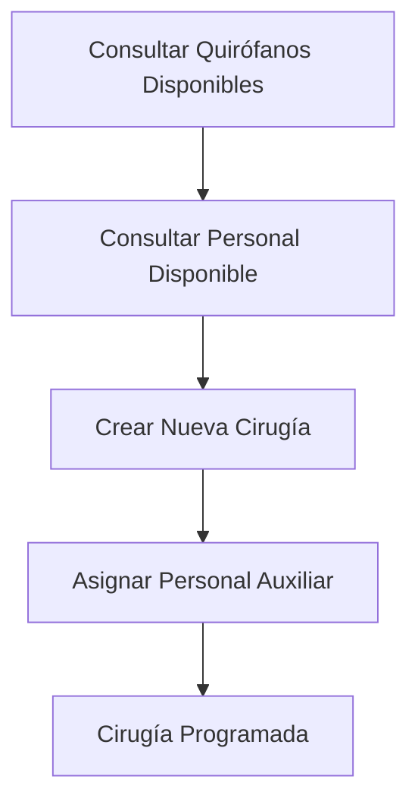
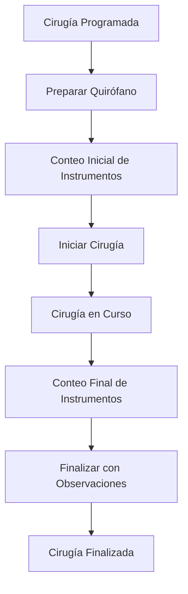
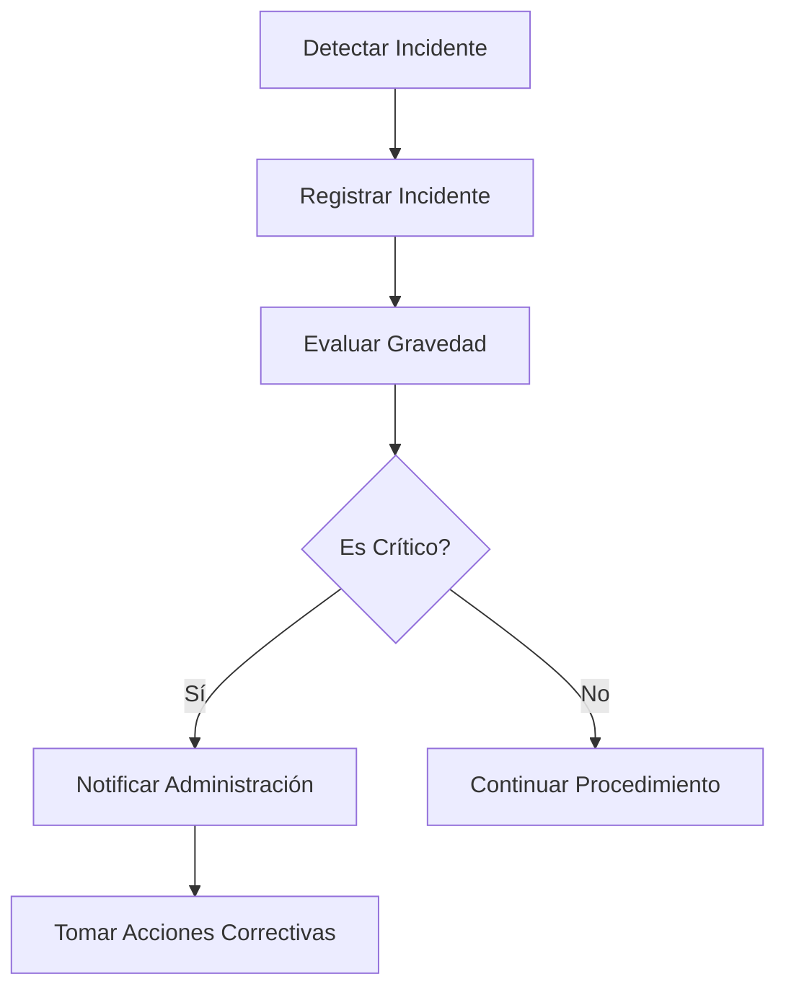

# 🏥 Sistema de Gestión Hospitalaria - Documentación de API

Este repositorio contiene la documentación completa de la API del Sistema de Gestión Hospitalaria, un sistema diseñado para manejar eficientemente las operaciones quirúrgicas, gestión de personal médico, y administración de recursos hospitalarios.

## 📚 Documentación Disponible

### 🔐 APIs de Autenticación y Administración
- **[API de Autenticación](auth.md)** - Login, registro y gestión de sesiones
- **[API de Administración](admin.md)** - Gestión completa del sistema (usuarios, pacientes, quirófanos, etc.)

### 👩‍⚕️ APIs de Personal Médico
- **[API de Enfermera Jefe](api/enfermera-jefe.md)** - Gestión completa de cirugías y asignación de recursos

### 🔧 APIs de Instrumentación
- **[API de Instrumentador](instrumentador.md)** - Gestión de instrumentos y conteo quirúrgico
- **[API de Cirujano](cirujano.md)** - Funcionalidades específicas para cirujanos

## 🏗️ Arquitectura del Sistema

### Roles del Sistema

El sistema está diseñado con diferentes niveles de acceso según el rol del usuario:

#### 🛡️ **Administrador**
- Gestión completa de usuarios y roles
- Configuración de quirófanos y categorías
- Gestión de pacientes
- Configuración de tipos de cirugía
- Reportes y estadísticas generales
- Gestión de entidades suministradoras

#### 👩‍⚕️ **Enfermera Jefe**
- **Asignación de Cirugías**: Crear, editar y eliminar cirugías
- **Gestión de Personal**: Asignar cirujano principal, auxiliares, anestesiólogos e instrumentadores
- **Control de Estados**: Iniciar y finalizar cirugías
- **Observaciones**: Recopilar observaciones del personal médico al finalizar cirugías
- **Disponibilidad**: Consultar disponibilidad de quirófanos y personal

#### 🔧 **Instrumentador**
- Gestión de instrumentos quirúrgicos
- Conteo inicial y final de instrumentos
- Control de esterilización
- Registro de incidentes con instrumentos

#### ⚕️ **Cirujano**
- Acceso a información de sus cirugías asignadas
- Registro de observaciones durante y después de las cirugías
- Consulta de historial de pacientes

### Estados de Cirugía

Las cirugías siguen un flujo de estados bien definido:

```
programada → en_preparacion → conteo_inicial → en_curso → conteo_final → finalizada
                                ↓
                           pospuesta/cancelada
```

### Tipos de Personal en Cirugías

- **Cirujano Principal**: Responsable principal de la cirugía
- **Cirujanos Auxiliares**: Apoyo durante la cirugía
- **Anestesiólogo**: Manejo de la anestesia
- **Instrumentador**: Gestión de instrumentos
- **Residentes**: Personal en formación
- **Observadores**: Personal en aprendizaje

## 🚀 Inicio Rápido

### Configuración Base

1. **Autenticación**: Todas las APIs requieren autenticación via token JWT
2. **Base URL**: `http://localhost:3000/api/v1`
3. **Content-Type**: `application/json`

### Ejemplo de Autenticación

```javascript
// Login
const response = await fetch('/api/v1/auth/login', {
  method: 'POST',
  headers: {
    'Content-Type': 'application/json'
  },
  body: JSON.stringify({
    email: 'admin@hospital.com',
    password: 'password123'
  })
});

const { token } = await response.json();

// Usar token en subsiguientes requests
const apiResponse = await fetch('/api/v1/enfermera_jefe/cirugias', {
  headers: {
    'Authorization': `Bearer ${token}`,
    'Content-Type': 'application/json'
  }
});
```

## 📋 Flujos de Trabajo Principales

### 1. Flujo de Creación de Cirugía (Enfermera Jefe)



### 2. Flujo de Ejecución de Cirugía



### 3. Flujo de Gestión de Incidentes



## 🔍 Ejemplos de Uso Común

### Crear una Cirugía Completa

```javascript
// 1. Consultar quirófanos disponibles
const quirofanos = await fetch('/api/v1/enfermera_jefe/quirofanos-disponibles?fecha=2025-01-20&hora=14:30');

// 2. Consultar personal disponible
const cirujanos = await fetch('/api/v1/enfermera_jefe/personal-disponible?tipo_personal=cirujanos');
const anestesiologos = await fetch('/api/v1/enfermera_jefe/personal-disponible?tipo_personal=anestesiologos');

// 3. Crear la cirugía
const cirugia = await fetch('/api/v1/enfermera_jefe/cirugias', {
  method: 'POST',
  headers: {
    'Authorization': `Bearer ${token}`,
    'Content-Type': 'application/json'
  },
  body: JSON.stringify({
    paciente_id: 1,
    tipo_cirugia_id: 3,
    quirofano_id: 2,
    cirujano_principal_id: 5,
    instrumentador_id: 12,
    fecha_programada: "2025-01-20T14:30:00.000Z",
    prioridad: "alta",
    personal_auxiliar: [
      { usuario_id: 15, rol_cirugia: "anestesiologo" },
      { usuario_id: 18, rol_cirugia: "cirujano_auxiliar" }
    ]
  })
});
```

### Gestión de Estados de Cirugía

```javascript
// Iniciar cirugía
await fetch(`/api/v1/enfermera_jefe/cirugias/${cirugiaId}/iniciar`, {
  method: 'PUT',
  headers: { 'Authorization': `Bearer ${token}` }
});

// Finalizar cirugía con observaciones
await fetch(`/api/v1/enfermera_jefe/cirugias/${cirugiaId}/finalizar`, {
  method: 'PUT',
  headers: {
    'Authorization': `Bearer ${token}`,
    'Content-Type': 'application/json'
  },
  body: JSON.stringify({
    observaciones_finales: "Cirugía exitosa sin complicaciones",
    diagnostico_postoperatorio: "Paciente estable",
    observaciones_cirujano: "Procedimiento estándar",
    observaciones_anestesiologo: "Anestesia sin incidentes"
  })
});
```

## 📊 Códigos de Respuesta HTTP

| Código | Significado | Descripción |
|--------|-------------|-------------|
| 200 | OK | Operación exitosa |
| 201 | Created | Recurso creado exitosamente |
| 400 | Bad Request | Datos inválidos o faltantes |
| 401 | Unauthorized | Token inválido o expirado |
| 403 | Forbidden | Sin permisos para la operación |
| 404 | Not Found | Recurso no encontrado |
| 409 | Conflict | Conflicto (ej: quirófano ocupado) |
| 500 | Internal Server Error | Error interno del servidor |

## 🛠️ Herramientas de Desarrollo

### Postman Collection
Se recomienda usar Postman para probar las APIs. Puedes importar las colecciones desde:
- [Colección de Autenticación](postman/auth.json)
- [Colección de Enfermera Jefe](postman/enfermera-jefe.json)
- [Colección de Admin](postman/admin.json)

### Variables de Entorno
```json
{
  "baseUrl": "http://localhost:3000/api/v1",
  "authToken": "{{token_jwt}}",
  "userId": "{{user_id}}"
}
```

## 🤝 Contribución

Para contribuir a la documentación:

1. Fork el repositorio
2. Crea una rama para tu funcionalidad
3. Actualiza la documentación correspondiente
4. Envía un Pull Request

## 📞 Soporte

Para soporte técnico o preguntas sobre la API:
- Email: dev@hospital.com
- Slack: #api-support
- Issues: GitHub Issues

---

**Nota**: Esta documentación se actualiza continuamente. Verifica siempre la versión más reciente antes de implementar nuevas funcionalidades. 